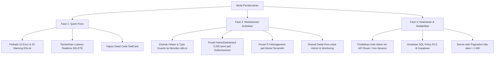

# 📋 Audit & Code Review: Form Pemesanan Nakoms (Rizzmed)

Dokumen ini berisi hasil audit menyeluruh terhadap arsitektur, kualitas kode, celah keamanan, performa, serta masalah kode yang menumpuk (*technical debt*) pada proyek **Form Pemesanan Nakoms (BEM Unsoed 2026)**.

---

## 1. Ringkasan Eksekutif

| Indikator | Status Saat Ini | Keterangan |
| :--- | :--- | :--- |
| **Status Build TypeScript** | 🟢 Berhasil (`tsc --noEmit` exit 0) | Tidak ada type error yang memblokir kompilasi. |
| **Status ESLint** | 🔴 Gagal (`10 errors, 20 warnings`) | Terdapat unescaped entities, penggunaan `any`, dan unused variables. |
| **Maintainability** | 🟠 Kurang Ideal | Terdapat file raksasa (*God Component*) mencapai **3.265 baris**. |
| **Duplikasi Kode** | 🔴 Tinggi | Duplikasi ~80% antara `AdminDashboard` dan `MonitoringDashboard`. |
| **Keamanan Auth** | 🔴 Kritis | Kredensial admin di-hardcode di sisi client (browser bundle). |
| **Realtime Sync** | 🟡 Ada Bug Senyap | Event realtime `DELETE` diabaikan, menyebabkan data "hantu" di tabel. |

---

## 2. Temuan Error & Warning ESLint (`npm run lint`)

Perintah linter mendeteksi **30 masalah** (10 error dan 20 warning):

| No | File | Baris | Tipe | Pesan ESLint / Masalah | Solusi |
| :---: | :--- | :---: | :---: | :--- | :--- |
| 1 | `src/components/form/FormDesainPublikasi.tsx` | 187 | Error | `react/no-unescaped-entities`<br>Karakter tanda kutip `"-"` di dalam JSX tidak di-escape. | Ganti dengan `&quot;-&quot;` atau `&ldquo;-&rdquo;`. |
| 2 | `src/components/form/OrderForm.tsx` | 314, 387 | Error | `@typescript-eslint/no-explicit-any`<br>`catch (error: any)` | Ganti dengan `catch (error: unknown)` dan gunakan helper pesan error. |
| 3 | `src/components/form/OrderForm.tsx` | 363, 370, 374, 415 | Error | `@typescript-eslint/no-explicit-any`<br>Typecast `(data as any)` dan `identityForm as any` | Gunakan type guard atau diskriminator union yang tepat. |
| 4 | `src/components/layout/ThemeProvider.tsx` | 15 | Error | `@typescript-eslint/no-explicit-any`<br>`ThemeProviderProps & any` | Gunakan `React.ComponentProps<typeof NextThemesProvider>`. |
| 5 | `src/components/admin/AdminDashboard.tsx` | 356 | Error | `prefer-const`<br>Variabel `contacts` dibuat dengan `let` namun tidak pernah di-reassign. | Ubah deklarasi menjadi `const`. |
| 6 | `src/components/admin/AdminDashboard.tsx` | 92, 93, 485, 498 | Warning | `@typescript-eslint/no-unused-vars`<br>Import `Save`, `X` dan parameter `e` tidak digunakan. | Hapus import dan parameter yang tidak dipakai. |
| 7 | `src/components/schedule/ScheduleCalendar.tsx` | 11, 12, 13 | Warning | `@typescript-eslint/no-unused-vars`<br>Import `DesainPublikasiOrder`, dll tidak digunakan. | Hapus import yang tidak diperlukan. |
| 8 | `src/lib/types.ts` | 2 | Warning | `@typescript-eslint/no-unused-vars`<br>Import FormValues tidak digunakan. | Hapus import tidak terpakai dari `schema.ts`. |
| 9 | `src/components/form/SuccessMessage.tsx` | 8 | Warning | `@typescript-eslint/no-unused-vars`<br>`DAYS_OF_WEEK` diimpor tapi tidak dipakai. | Bersihkan import. |
| 10 | `src/components/form/OrderForm.tsx` | 4, 20 | Warning | `@typescript-eslint/no-unused-vars`<br>`Image`, `JENIS_BANTUAN_OPTIONS` tidak terpakai. | Bersihkan import. |

---

## 3. Analisis "Code Numpuk" & Masalah Arsitektur

### A. Monolithic File: `AdminDashboard.tsx` (3.265 Baris)
File [AdminDashboard.tsx](file:///d:/Coding/GitHub/Form-Pemesanan-Nakoms/src/components/admin/AdminDashboard.tsx) telah menjadi *God Component* yang memikul terlalu banyak fungsi:
1. **Manajemen 4 Menu Pesanan**: Render tabel `desain_publikasi`, `website`, `bantuan_teknis`, dan `survey` dengan logika inline edit, accordion detail, dan modal terpisah.
2. **Sistem Penugasan PJ (800+ Baris)**: Render manajemen Master PJ Contacts, pembagian shift harian PJ Publikasi (beserta validasi kuota maksimal 2 hari), mapping Kemenko PJ Twibbon, dan penugasan per kementerian.
3. **Statistik & Heatmap (400+ Baris)**: Perhitungan matrix heatmap aktivitas 84 hari, summary cards, dan grafik status.
4. **Dead Code**: Terdapat komponen `StatCard` di baris 163-192 yang dideklarasikan tetapi **tidak pernah dipakai sama sekali**.

> **Dampak:** Setiap kali user mengetik pada kolom filter atau membuka 1 baris detail, React berpotensi mengevaluasi ulang pohon komponen berukuran 3.200 baris ini.

### B. Duplikasi Kode Masif: `AdminDashboard.tsx` vs `MonitoringDashboard.tsx`
File [MonitoringDashboard.tsx](file:///d:/Coding/GitHub/Form-Pemesanan-Nakoms/src/components/monitoring/MonitoringDashboard.tsx) (**1.189 baris**) merupakan salinan ~80% dari `AdminDashboard.tsx`, dengan tombol aksi admin dihilangkan:
- Type guards (`isDesainPublikasi`, `isWebsite`, dll) ditulis ulang manual.
- Logika deteksi jadwal tabrakan (`scheduleCollisions`, `hasCollision`, `COLLISION_EXEMPT_WAKTU_PUBLIKASI`) disalin persis.
- Tampilan baris detail Twibbon & Desain disalin ulang.
- Logika filtering dan pagination ditulis ulang.

> **Dampak:** Setiap ada penambahan kolom atau fitur (seperti tombol Copy caption atau field baru), developer harus melakukan copy-paste di kedua file secara manual, yang rawan menimbulkan inkonsistensi.

### C. Redundansi Modul Statistik
Aplikasi memiliki halaman publik `/statistik` dengan komponen [StatistikDashboard.tsx](file:///d:/Coding/GitHub/Form-Pemesanan-Nakoms/src/components/statistik/StatistikDashboard.tsx) (berbasis triwulan). Namun di dalam `AdminDashboard.tsx` terdapat tab "Statistik" kedua dengan format berbeda (heatmap 84 hari). Kedua komponen ini menghitung metrik yang tumpang tindih secara terpisah.

---

## 4. Bug Fungsional & Sinkronisasi Realtime

### Realtime `DELETE` Event Terabaikan (*Silent Bug*)
Pada `AdminDashboard.tsx` (baris 300) dan `MonitoringDashboard.tsx` (baris 152):
```tsx
const channel = supabase
  .channel("orders_realtime")
  .on("postgres_changes", { event: "*", schema: "public", table: "orders" }, (payload) => {
    if (payload.eventType === "INSERT") {
      setOrders((prev) => [payload.new as Order, ...prev]);
    } else if (payload.eventType === "UPDATE") {
      setOrders((prev) =>
        prev.map((order) =>
          order.id === (payload.new as Order).id ? (payload.new as Order) : order
        )
      );
    }
    // ⚠️ BUG: Cabang "DELETE" TIDAK DITANGANI!
  })
```
**Dampak:** Ketika Admin A menghapus pesanan, atau pesanan dihapus langsung dari database, tabel di browser Admin B dan seluruh pengguna di halaman Monitoring **tidak akan menghapus baris tersebut** secara realtime. Pesanan "hantu" ini baru hilang jika halaman di-refresh.

**Solusi:**
```tsx
} else if (payload.eventType === "DELETE") {
  setOrders((prev) => prev.filter((order) => order.id !== payload.old.id));
}
```

---

## 5. Celah Keamanan (*Security Concerns*)

### A. Kredensial Hardcoded di Sisi Client
Pada [AdminLogin.tsx](file:///d:/Coding/GitHub/Form-Pemesanan-Nakoms/src/components/admin/AdminLogin.tsx#L12-L13):
```ts
const ADMIN_USERNAME = "admin";
const ADMIN_PASSWORD = "rizzmed2026";
```
- **Risiko Kritis:** Password ini terkompilasi langsung ke bundle file JavaScript publik (`_next/static/chunks/...`). Siapa saja dapat membuka DevTools, mencari string `rizzmed2026`, atau langsung mengetik:
  ```javascript
  localStorage.setItem("adminAuth", "true");
  ```
  lalu mengakses seluruh dashboard admin tanpa perlu mengetahui username/password.

### B. Otorisasi Mutasi Supabase Menggunakan Anon Key
Semua mutasi database (`orders.update()`, `orders.delete()`, `pj_mappings.update()`) dipanggil dari browser via `NEXT_PUBLIC_SUPABASE_ANON_KEY`.
- Jika Row Level Security (RLS) di Supabase membuka policy `UPDATE` atau `DELETE` untuk publik (`anon`), siapa pun yang memiliki URL dan Anon Key dapat mengubah atau menghapus data pemesanan via script / Postman.

---

## 6. Masalah Performa & Skalabilitas

### Unbounded Fetching (`while (hasMore)`)
Fungsi `fetchOrders` di Admin dan Monitoring mengambil seluruh baris database ke memori client:
```ts
while (hasMore) {
  const { data } = await supabase
    .from("orders")
    .select("*")
    .range(from, from + PAGE_SIZE - 1);
  ...
}
```
Untuk ratusan pesanan saat ini hal ini masih responsif. Namun jika pesanan mencapai ribuan dengan teks caption dan link yang panjang:
1. Browser client akan menampung array objek yang sangat besar di memory heap.
2. Memperlambat First Contentful Paint (FCP) dan Time to Interactive (TTI).
3. Menghabiskan kuota *egress bandwidth* Supabase.

---

## 7. Rekomendasi Solusi & Rencana Aksi (*Roadmap*)



### Rekomendasi Struktur Folder Hasil Modularisasi
```text
src/components/admin/
├── AdminDashboard.tsx           # Hanya orkestrasi tab & state utama (< 300 baris)
├── tables/
│   ├── DesainPublikasiTable.tsx # Tabel & inline edit desain
│   ├── WebsiteTable.tsx         # Tabel & detail twibbon/shortlink
│   ├── BantuanTeknisTable.tsx   # Tabel bantuan teknis
│   └── SurveyTable.tsx          # Tabel survey
├── pj/
│   ├── PJManagementTab.tsx      # Komponen utama kelola PJ
│   ├── PJContactsManager.tsx    # CRUD kontak Master PJ
│   └── PJAssignmentTable.tsx    # Shift publikasi & twibbon
├── filters/
│   └── OrderFilters.tsx         # Dropdown filter tanggal, status, kementerian
└── shared/
    ├── TwibbonDetailRow.tsx     # Komponen detail twibbon (dipakai Admin & Monitoring)
    └── CollisionAlert.tsx       # Peringatan tabrakan jadwal
```
