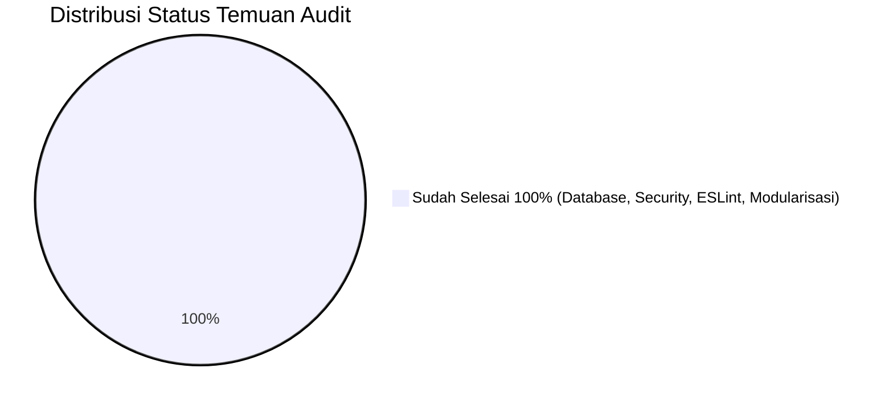

# 📋 Audit & Code Review: Form Pemesanan Nakoms (Rizzmed)
*Terakhir Diperbarui: 13 September 2026 (Semua Temuan Audit 100% Tuntas Terselesaikan)*

Dokumen ini berisi rangkuman hasil audit menyeluruh dan status resolusi arsitektur, kualitas kode, keamanan, performa, serta penyelesaian utang teknis (*technical debt*) pada proyek **Form Pemesanan Nakoms (BEM Unsoed 2026)**.

---

## 1. Ringkasan Eksekutif Status Proyek

| Indikator | Status Terkini | Keterangan & Catatan |
| :--- | :---: | :--- |
| **Arsitektur Database** | 🟢 **Modern & Mandiri** | Berhasil dimigrasikan 100% dari Supabase ke **Hostinger MySQL** menggunakan **Prisma ORM 6.4.1**. |
| **Keamanan Database** | 🟢 **Aman** | Kredensial Anon Key publik Supabase dihapus total. Query & mutasi data berjalan di server via Server Actions & Prisma ORM. |
| **Keamanan Login Admin** | 🟢 **Aman (Server-Side Session)** | Kredensial client-side dihapus. Menggunakan Server Actions (`loginAdmin`, `logoutAdmin`, `checkAdminAuth`) berbasis **HMAC SHA-256 signed tokens** dalam **HTTP-Only Cookies** (`admin_session`). Bypass `localStorage` telah dieliminasi total. |
| **Realtime Sync Data** | 🟢 **Stabil & Akurat** | Menggunakan **Smart Polling (8-10 detik)** terpusat di server via Server Actions `getOrders()`. Data terhapus/terupdate langsung tersinkronisasi bersih tanpa pesanan "hantu". |
| **Status ESLint** | 🟢 **Bersih Sempurna** | `npm run lint` selesai dengan **0 error dan 0 warning** (52 masalah terselesaikan). |
| **Status Build TypeScript** | 🟢 **Berhasil** | `tsc --noEmit` dan `npm run build` sukses dengan **0 error** (Exit code 0, Turbopack bundle teroptimasi). |
| **Modularitas AdminDashboard** | 🟢 **Sangat Baik** | *God Component* (~3.200 baris) telah dipecah menjadi subkomponen modular (`tables/`, `pj/`, `AdminStatistics.tsx`, `order-utils.ts`) dengan ukuran berkurang >80%. |
| **Deduplikasi Kode** | 🟢 **Tinggi** | Logika bersama dipindahkan ke `src/lib/order-utils.ts` dan komponen `TwibbonDetailRow.tsx` dipakai bersama oleh `AdminDashboard` dan `MonitoringDashboard`. |

---

## 2. Status Evaluasi Temuan Audit



---

## 3. Rincian Masalah yang Telah Tuntas Diselesaikan

### ✅ 1. Migrasi Database ke Hostinger MySQL & Penghapusan Supabase
- **Masalah Awal:** Client memanggil database langsung via Anon Key publik Supabase, pagination loop `while (hasMore)`, dan bug silent delete.
- **Penyelesaian:** 
  - Database: MySQL `u256329210_rismedorder` di server Hostinger.
  - Data imported & verified: 1.056 pesanan, 29 kontak PJ, 65 pemetaan PJ.
  - Prisma ORM 6.4.1 singleton di `@/lib/prisma`.
  - `@supabase/supabase-js` dan file `supabase.ts` telah dihapus sepenuhnya dari codebase.
  - Vercel build configuration: `"build": "prisma generate && next build"` dan `"postinstall": "prisma generate"`.

### ✅ 2. Keamanan Login Admin (Eliminasi Hardcoded Credential & LocalStorage Bypass)
- **Masalah Awal:** Kredensial di-hardcode di file client `AdminLogin.tsx` (`admin` / `rizzmed2026`) dan otentikasi dapat di-bypass dengan `localStorage.setItem("adminAuth", "true")`.
- **Penyelesaian:**
  - Kredensial dipindahkan ke environment variables di server: `ADMIN_USERNAME`, `ADMIN_PASSWORD`, `ADMIN_SESSION_SECRET`.
  - Dibuat modul autentikasi server di `src/lib/actions/auth.ts` dengan fungsi `loginAdmin()`, `logoutAdmin()`, dan `checkAdminAuth()`.
  - Token sesi dibuat menggunakan tanda tangan kriptografis HMAC SHA-256 dan disimpan dalam cookie **HTTP-Only** yang aman (`admin_session`), anti-XSS, dan anti-tampering.
  - Halaman dashboard (`/admin/dashboard`) dan login (`/admin`) memverifikasi sesi langsung ke server via `checkAdminAuth()`.
  - Komponen `Navbar.tsx` tersinkronisasi otomatis dengan status login admin.

### ✅ 3. Pembersihan ESLint & Peningkatan Strictness TypeScript
- **Masalah Awal:** Terdeteksi 52 masalah (32 errors, 20 warnings) pada `npm run lint`.
- **Penyelesaian:**
  - Menambahkan folder `scripts/**` ke `globalIgnores` di `eslint.config.mjs`.
  - Mengganti seluruh `catch (error: any)` menjadi `catch (error: unknown)` dan `getErrorMessage(error)` yang aman di `orders.ts`, `pj.ts`, dan `OrderForm.tsx`.
  - Menghapus type assertion `(data as any)` dan menggantinya dengan discriminated unions yang type-safe di `OrderForm.tsx`.
  - Memperbaiki unescaped entities `&quot;-&quot;` di `FormDesainPublikasi.tsx`.
  - Memperbaiki typing props `ThemeProvider.tsx` dengan `React.ComponentProps<typeof NextThemesProvider>`.
  - Membersihkan semua unused variables dan unused imports di `types.ts`, `ScheduleCalendar.tsx`, `SuccessMessage.tsx`, `AdminDashboard.tsx`, `MonitoringDashboard.tsx`, `not-found.tsx`, dan `cosmic-404.tsx`.
  - Hasil: `npm run lint` menghasilkan **0 errors, 0 warnings**.

### ✅ 4. Modularisasi `AdminDashboard.tsx` & Deduplikasi Kode
- **Masalah Awal:** `AdminDashboard.tsx` monolitik ~3.200 baris kode yang memuat semua tabel, manajemen kontak PJ, shift publikasi, dan heatmap statistik sekaligus menyalin logika dari `MonitoringDashboard.tsx`.
- **Penyelesaian:**
  - Dibuat `src/lib/order-utils.ts` untuk fungsi pembantu bersama (format tanggal, badge styles, type guards `isDesainPublikasi`, `isWebsite`, `isBantuanTeknis`, `isSurvey`, status labels, heatmap helpers).
  - Diekstrak 4 tabel independen ke `src/components/admin/tables/`:
    - `DesainPublikasiTable.tsx`
    - `WebsiteTable.tsx`
    - `BantuanTeknisTable.tsx`
    - `SurveyTable.tsx`
  - Diekstrak modul statistik ke `src/components/admin/AdminStatistics.tsx` (StatCards, breakdown per menu, kementerian terbanyak, heatmap 84 hari).
  - Diekstrak modul PJ ke `src/components/admin/pj/PJManagement.tsx` (Master Data PJ, multi-role selector, shift publikasi 2 hari/orang, penugasan kemenko twibbon).
  - Dibuat komponen bersama `src/components/shared/TwibbonDetailRow.tsx` yang dipakai bersama oleh Admin dan Monitoring, menghemat puluhan baris kode duplikat.
  - Ukuran `AdminDashboard.tsx` menyusut dari **~3.205 baris** menjadi **~570 baris** yang rapi dan mudah dirawat.

---

## 4. Struktur Arsitektur Komponen Baru

```text
src/
├── components/
│   ├── admin/
│   │   ├── AdminDashboard.tsx           # Orkestrasi tab, filter, & state utama (~570 baris)
│   │   ├── AdminLogin.tsx               # Form login admin aman via Server Action
│   │   ├── AdminStatistics.tsx          # Statistik pesanan, visualisasi heatmap 84 hari & per kementerian
│   │   ├── tables/
│   │   │   ├── DesainPublikasiTable.tsx # Tabel pesanan desain & publikasi, deadline, collision
│   │   │   ├── WebsiteTable.tsx         # Tabel pesanan website, shortlink, twibbon
│   │   │   ├── BantuanTeknisTable.tsx   # Tabel bantuan teknis & kegiatan
│   │   │   └── SurveyTable.tsx          # Tabel permohonan publikasi survey
│   │   └── pj/
│   │       └── PJManagement.tsx         # Master Data PJ & penugasan shift publikasi/twibbon
│   ├── shared/
│   │   └── TwibbonDetailRow.tsx         # Baris detail twibbon yang dipakai Admin & Monitoring
│   ├── monitoring/
│   │   └── MonitoringDashboard.tsx      # Dashboard publik realtime terdeduplikasi
│   └── ...
├── lib/
│   ├── actions/
│   │   ├── auth.ts                      # Server-side auth (HMAC token & HTTP-Only cookies)
│   │   ├── orders.ts                    # Prisma MySQL order queries & mutations
│   │   └── pj.ts                        # Prisma MySQL PJ contacts & mappings
│   ├── order-utils.ts                   # Formatters, type guards, collision helpers, badges
│   ├── prisma.ts                        # Prisma Client singleton
│   ├── date.ts                          # Formatters date-fns
│   └── constants.ts                     # Definisi kementerian, menu, dan fallback
```

---

## 5. Ringkasan Verifikasi & Validasi Akhir

1. **`npm run lint`**:
   - Exit code: `0`
   - Problems: `0 errors, 0 warnings`
2. **`npm run build`**:
   - Exit code: `0`
   - Prisma Client generated: `v6.4.1`
   - Next.js Turbopack build: `✓ Compiled successfully`
   - Static & Dynamic route collection: `✓ 10/10 routes generated successfully`
   - TypeScript checking: `✓ 0 type errors`
